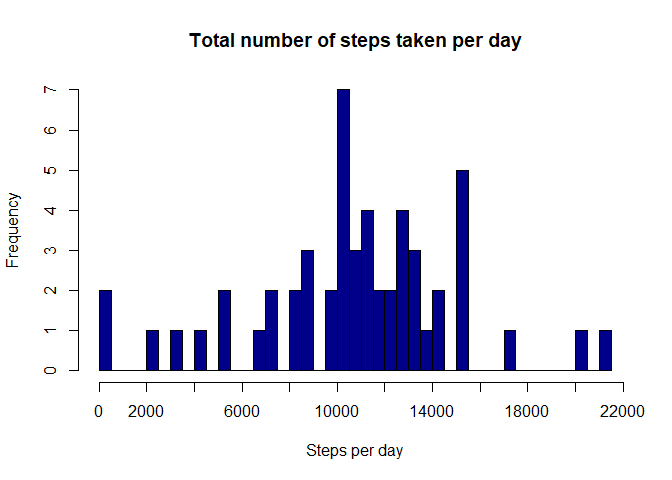

# Background
The assignment makes use of data from a personal activity monitoring device. This device collects data at 5 minute intervals through out the day. The data consists of two months of data from an anonymous individual collected during the months of October and November, 2012 and include the number of steps taken in 5 minute intervals each day. It is forked from this 
repository created for the assignment: http://github.com/rdpeng/RepData_PeerAssessment1

Below you find the answers to the questions in detail including calculations.

# Set Up Environment
First, the environment for the assignment is setup. This is done by loading the R libraries that are used and by setting the locale to make sure that English is used as language (necessary for using the weekdays() functions, see below).


```r
library(dplyr)
```

```
## 
## Attaching package: 'dplyr'
```

```
## The following objects are masked from 'package:stats':
## 
##     filter, lag
```

```
## The following objects are masked from 'package:base':
## 
##     intersect, setdiff, setequal, union
```

```r
library(ggplot2)
Sys.setlocale("LC_TIME", "English")
```

```
## [1] "English_United States.1252"
```

# Loading and preprocessing the data

## 1. Load the data
We unzip the zip-file with the data and read it into the data variable by using the read.csv-function.

```r
unzip("activity.zip")

data <- read.csv(file = "activity.csv", header = TRUE)
```

## 2. Process/transform the data
Preprocessing is done by converting the content of the date column from character format to R:s date format.

```r
data$date <- as.Date(data$date, format = "%Y-%m-%d")
```

# What mean total number of steps taken per day?
We ignore the missing (NA) values in the dataset for this part of the assignment, according to the assigment instructions.

## 1. Calculate the total number of steps taken per day
Calculation of total number of steps per day is done by using the aggregate function. We use this to summarize all the steps per each date instance (i.e. day)

```r
totalStepsPerDay <- aggregate(steps ~ date, data, sum)
```

## 2. Make a histogram of the total number of steps taken each day
A histogram of total number of steps taken each day is done with the hist function. We choose the max for the axis to cover the maximum number of ocurrances for steps for one day.


```r
hist(totalStepsPerDay$steps, 
     main = "Total number of steps taken per day", 
     xlab = "Steps per day",
     col = "darkblue",
     breaks = 50,
     xaxt = 'n'
)
axis(side = 1, at = seq(0, 22000, 2000))
```

<!-- -->

## 3. Calculate and report the mean and median of the total number of steps taken per day

The mean of total number of steps taken per day is:

```r
mean(totalStepsPerDay$steps)
```

```
## [1] 10766.19
```

The median of total number of steps taken per day is:

```r
median(totalStepsPerDay$steps)
```

```
## [1] 10765
```

# What is the average daily activity pattern?

## 1. Make a time series plot of the 5-minute interval and the average number of steps taken, averaged across all days
In the time series plot, for the 5-minute interval, the x-axis should be used and for the average number of steps taken, the y-axis should be used.

First we create an array with the number of steps taken on average (mean) for each part of the 5-minute interval.

```r
arrayNumStepsInterval <- tapply(data$steps, data$interval, mean, na.rm = TRUE)
```
We then create a data frame with the average number of steps per each 5-minute interval.


```r
dfNumStepsInterval <- data.frame(interval = as.integer(names(arrayNumStepsInterval)), average = arrayNumStepsInterval)
```
Then we construct the time series plot using this data frame using the ggplot system.


```r
ggplot(dfNumStepsInterval, 
       aes(interval, average)) + 
        geom_line(color = "darkblue") + 
        xlab("Intervals (5 minutes)") + 
        ylab("Average steps in interval"
) + ggtitle("Time series plot number of steps per 5-minute interval") + theme(plot.title = element_text(face = "bold", hjust = 0.5))
```

<!-- -->

## 2. Which 5-minute interval contains the maximum number of steps?
The interval the question relates to is the one on average across all the days in the dataset.

To find this out, we filter the data using pipelining commands. First we group the data by interval then we summarize the mean steps for each interval and create a new variable, *meanByInterval*, for this. After this we select the maximum such value.


```r
maxSteps <- data %>% group_by(interval) %>% 
  summarize(meanByInterval = mean(steps, na.rm = TRUE)) %>%
  filter(meanByInterval == max(meanByInterval))
maxSteps
```

```
## # A tibble: 1 x 2
##   interval meanByInterval
##      <int>          <dbl>
## 1      835           206.
```

We can see that the interval containg the maximum amount of steps is the interval 835.

By selecting the item in the date column which corresponds to this interval, we can find out which date this interval occured.

```r
data$date[maxSteps[[1]]]
```

```
## [1] "2012-10-03"
```
This interval occured 2012-10-03.

# Imputing missing values
For this part of the assignment we are made aware of that the missing values in the dataset (NA:s) can introduce bias into some calculations or summaries of the data. Therefore we are asked to manage, inpute, the missing data.

## 1. Calculate and report the total number of missing values in the dataset
First we make note of the rows where there are NA:s. For these rows we note a 1 in a separate, newly created, column in the dataset *naCount*.

```r
data$naCount <- apply(data, 1, function(x) sum(is.na(x)))
```
To answer the question on total number of missing values in the dataset, we summarize the *naCount* column.

```r
sum(data$naCount)
```

```
## [1] 2304
```
There are 2304 missing values in the dataset.

## 2. Devise a strategy for filling in all of the missing values in the dataset.
According to the assignment instructions, the strategy does not need to be sophisticated. For example, we are informed that we can use the mean/median for that day, or the mean for that 5-minute interval, etc.

We decided on using the mean value of the 5-minute interval to replace the missing values. For this, we first create a new column completeSteps. In that column we place the steps from the dataset if there are steps noted in the steps column in the datasets. If there are no steps entered in the datasets, i.e.NA:s, we enter the steps taken on average (mean) for each part of the 5-minute interval in this column. We use round to have only integers in the column.


```r
data$completeSteps <- ifelse(
        is.na(data$steps), 
                round(dfNumStepsInterval$average[match(data$interval, 
                        dfNumStepsInterval$interval)], 0), 
                data$steps
)
```

### 3. Create a new dataset with the missing data filled in.
This dataset should be equal to the original dataset except from that now the missing data should be filled in (replaced). A dataset, *dataActivityComplete*, is created with activity values for all 5-minute intervals.

```r
dataActivityComplete <- data.frame(steps = data$completeSteps, interval = data$interval, date = data$date)
```

## 4. Make a histogram of the total number of steps taken each day
We first use the aggregate function to summarize the steps per date and create the data frame *totalStepsPerDayNoNA*.

```r
totalStepsPerDayNoNA <- aggregate(steps ~ date, data = dataActivityComplete, sum)
```

Then we print the histogram using this data frame.

```r
hist(totalStepsPerDayNoNA$steps, 
     main = "Total number of steps taken per day (no missing values)", 
     xlab = "Steps per day",
     col = "darkblue",
     breaks = 50,
     xaxt = 'n'
)
axis(side = 1, at = seq(0, 22000, 2000))
```

<!-- -->

### Calculate and report the mean and median total number of steps taken per day
The mean of total number of steps taken per day (when using No NA:s) is:

```r
mean(totalStepsPerDayNoNA$steps)
```

```
## [1] 10765.64
```

The median of total number of steps taken per day (when using No NA:s) is:

```r
median(totalStepsPerDayNoNA$steps)
```

```
## [1] 10762
```

### What is the impact of imputing missing data on the estimates of the total daily number of steps?
The mean after replacing NA-values has increased a little bit, from 10766.19 to 10765.64.

The median after replacing NA-values has not changed.

# Are there differences in activity patterns between weekdays and weekends?
For this part of the assignment we are recommended to use the weekdays() function in R. We are instructed to use the dataset with the filled-in missing values for this part of the assignment. We therefore use the data frame named *dataActivityComplete*.

## 1. Create a new factor variable in the dataset indicating whether a given date is a weekday or weekend day
First we create a new column in this dataframe with the name of the day for the specific observation. After this we create another column which we call weekend. This column either gets the character value "Weekend" or "Weekday" dependning on the content of the day variable. The setting of the variables is done with pipelining commands, the mutate function and inside that a conditional ifelse statement.

```r
dataActivityComplete <- dataActivityComplete %>% mutate(day = weekdays(date)) %>%
  mutate(weekend = ifelse(day == "Saturday" | day == "Sunday", "Weekend", "Weekday"))
```

## 2. Make a panel plot containing a time series plot of the 5-minute interval and the average number of steps taken, averaged across all weekday days or weekend days.
In the time series plot, for the 5-minute interval, the x-axis should be used and for the average number of steps taken, the y-axis should be used.

We make a plot using the *dataActivityComplete* data frame and the ggplot system.

```r
dataActivityComplete %>% 
  group_by(weekend, interval) %>% mutate(meanStepsInterval = mean(steps)) %>%
  ggplot(aes(x = interval, y = meanStepsInterval)) + 
        geom_line(color = "darkblue") +
        facet_wrap(~ weekend) + 
        xlab("Intervals (5 minutes)") + 
        ylab("Mean steps in interval") +
        ggtitle("Mean Steps by Interval: Weekday vs. Weekend") + 
                theme(plot.title = element_text(face = "bold", hjust = 0.5))
```

<!-- -->
